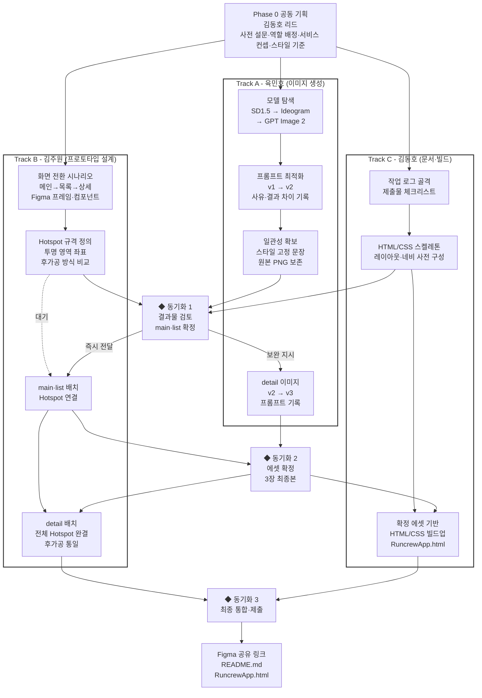
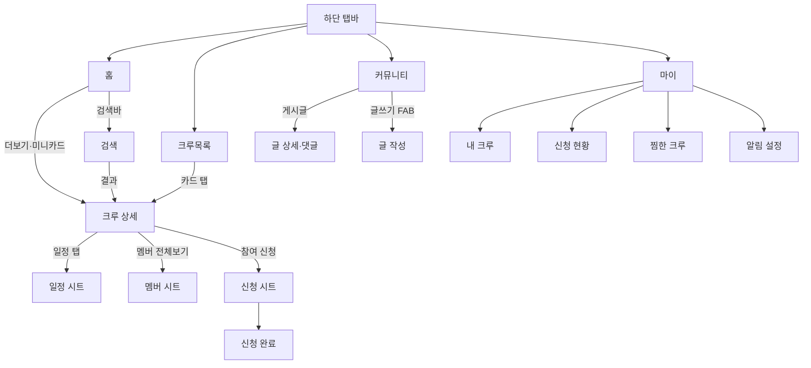

#### [Basic Term Project_5th Group] 작업 로그 - (Project A) AI 기반 UI/UX 디자인 시안 제작

- 제출물 구분: 결과물 ② 작업 로그 문서 (1개)  
- 선택한 프로젝트: Project A  
- 프로젝트 주제: 러닝 크루 매칭 앱 화면 시안 제작  
- 저장소:   
- 문서 설명: 이 문서는 `기획 → 프롬프트 → 이미지 생성 → 후가공 → 프로토타입`으로 이어지는 AI 협업 워크플로우의 과정 기록이다. 평가 대상은 결과 이미지의 완성도가 아니라 "어떤 단어를 넣었더니 무엇이 어떻게 달라졌는가"이므로, 화면별로 프롬프트 원문(v1 → v2)과 변경 사유·결과 차이를 그대로 남긴다.  

---

### 0. 사용 도구 (과제 §6 — 도구 사용 및 명)

| 구분 | 도구 | 계정 구분 | 사용 이유 | 제출물 활용 |
|---|---|---|---|---|
| 이미지 생성/수정 | **ChatGPT — GPT Image 2<br> (gpt-image-2)** | ChatGPT 유료 플랜 | 한글 텍스트 렌더링 정확도가 검토 대상 중 가장 높음. 3장 전체를 단일 모델로 통일 가능 | 최종 3장 전체 생성 |
| 이미지 생성 (검토·미채택) | Stable Diffusion 1.5 (로컬, AUTOMATIC1111) / UI-UX LoRA / Ideogram / Bing Image Creator / Leonardo AI | — | 모델 비교 검토 단계에서만 사용, 최종 산출물에는 미포함 | N/A |
| 프로토타입 | **Figma** | 무료 플랜 | 과제 권장 도구 | Hotspot, Overlay 후가공 |
| Html/Css 변환 | **Claude Opus 4.8** | Pro 구독형 | 빌드업(코딩) | AI 생성물을 활용한 html/css 기반 사이트 구축 |
> (§6 제약 사항) 외부 레퍼런스 이미지를 사용한 경우 이 표 아래에 출처(작성자·URL)를 기록해야 한다. 타인 작업물(Pinterest·Dribbble) 캡처 제출은 금지 사항이다.
> *→ 본 제출물에서 외부 레퍼런스 이미지나 타인 작업물을 사용하지 않았습니다. 화면 레이아웃은 프롬프트 텍스트만으로 생성했으며, 외부 디자인 이미지를 레퍼런스로 입력하지 않았습니다.*
---

## 0-1. 산출물 구성

| 항목 | 버전 | 내용 | 제출 형태 |
|---|---|---|---|
| 레이아웃 이미지 | v1 | main, list, detail 레이아웃 3장  | .png (이미지) |
| 레이아웃 이미지 | v2 | main, list, detail 레이아웃 3장<br>(main과 list는 이게 최종)  | .png (이미지) |
| 레이아웃 이미지 | 최종 | detail 레이아웃 1장  | .png (이미지) |
| 작업 로그 | 최종 | 프롬프트 변경 이력 · 후가공 기록 · 프로토타입 명세 | README.md (문서) |
| Figma 링크 | 최종 | 그림 3장을 얹고 화면 전환을 연결한 시연용 프로토타입 | 공유 링크 (보기 권한 공개) |
| 보너스 과제 제출 | 최종 | 시연용 프로토타입 html 사이트앱 | RuncrewApp.html (파일) |
> Figma 링크: https://www.figma.com/design/XnTj4Hm1SKSKtktYlxihJu/%EC%A0%9C%EB%AA%A9-%EC%97%86%EC%9D%8C?node-id=0-1&p=f&t=FicCzWjq2c0L8YKw-0

## 0-2. 기획 (팀장 주도 팀원 전체)

# 서비스 주제 선정
<details>
   <summary>펼치기</summary>
N마리너_김동호 — 2026-07-25 오전 12:42
가이드를 보면 컨텐츠 선정이 필요합니다.
아래 예시(1~6)에서 맘에 드는 걸 투표해주세요. (이모지 기능 사용, 복수 투표 가능)
혹은 추천도 가능합니다.

📱 Project A 주제 후보
1. 러닝 크루 매칭
 · 난이도 쉬움
메인: 추천 크루 카드 / 목록: 지역별 + 필터 / 상세: 소개·일정·신청

2. 동네 카페 큐레이션
 · 난이도 쉬움
메인: 오늘의 추천 / 목록: 지도·리스트 / 상세: 사진·메뉴·리뷰

3. 중고 취미장비 거래
 · 난이도 쉬움
메인: 인기 매물 / 목록: 카테고리별 / 상세: 사진·가격·판매자

4. 전시·공연 정보
 · 난이도 보통
메인: 이번 주 추천 / 목록: 날짜별 / 상세: 포스터·정보·예매

5. 홈트 루틴 추천
 · 난이도 어려움 (인체 왜곡 주의)
메인: 오늘의 운동 / 목록: 부위별 / 상세: 동작 설명·타이머

6. 야구 직관 메이트 매칭 (KBO 컨셉)
 · 난이도 보통
메인: 오늘의 경기 카드 / 목록: 구장별 동행 모집 + 필터 / 상세: 모집글·좌석·신청
⚠️ 실제 구단 로고·유니폼·선수 사진은 저작권 문제로 사용 불가 → 가상 구단명·컬러로 제작
⚠️ 스코어보드 등 숫자 요소는 AI 텍스트 깨짐이 심해 후가공 부담 ↑

위 6개는 참고용입니다. 다른 소재도 얼마든지 환영합니다.
선정 조건 — 메인/목록/상세가 자연스럽게 나뉠 것 · 이미지 중심일 것 · 스타일을 한 문장으로 정의 가능할 것

각자 편한 번호에 반응 남겨주세요 1️⃣2️⃣3️⃣4️⃣5️⃣6️⃣ 
</details>

# 업무 배정/담당자 선정
- 담당자 선정 방법: 사전 설문 조사를 실시하였다.
<details>
   <summary>펼치기</summary>
(1)
   N마리너_김동호 — 2026-07-24 오전 11:18<br>
안녕하세요? 팀장 김동호라고 합니다. Term Project 앞으로 잘 부탁드리고, 최대한 리드해볼테니 잘 따라와주시고 협조 잘해주시면 감사하겠습니다.<br>

과제 선정을 위한 설문을 간단히 부탁드립니다.(기한: ~7/24(금) 오전12시(0시))<br>
https://forms.gle/DbPPp5PXKt6eeRZL6

(2)
   N마리너_김동호 — 2026-07-25 오전 9:05<br>
[설문 결과보고 공유]<br>
링크: https://github.com/Hoyasiro/Codyssey_Native_Basic_Term_Project/blob/main/Mission_Selection_Assessment_Report.md<br>

10시에 미션이 시작됩니다.<br>
</details>

- 결과

| 담당자 | 담당 업무 | 배정 근거 |
|---|---|---|
| **김주원** | Figma 프로토타입 구축 | 사전 설문에서 강점으로 **Figma 사용 이력**을 기재 → 도구 숙련도를 그대로 활용 가능 |
| **육민호** | 레이아웃 페이지 생성 | 사전 설문에서 강점으로 **이미지 생성 및 수정**을 기재 → 모델 탐색·프롬프트 최적화에 직결 |
| **김동호** (팀장) | ① 작업 로그 문서 작성<br>② HTML/CSS 구축 | ① 프로젝트 전반을 리딩·검토하며 작업 정보가 자연스럽게 축적되어, 최종 발표자료 정리에 유리<br>② 바이브 코딩 기반 HTML/CSS 빌드 경험 보유 |


# 프로젝트 리드 전략
코디세이 교육 초반 단계의 팀원들을 효율적으로 관리하기 위해 다음과 같이 전략을 수립했다.

① 역량 파악 및 역할 배정
사전 설문을 통해 팀원의 관심도와 강점을 파악한 후 개별 역량에 맞는 업무를 배정했다. 이는 각자의 강점을 실제 업무에 활용하여 효율성을 높이기 위함이다.

② 시간 최소화 및 병렬 작업 도입
개인당 주 6시간 이내의 작업량을 목표로 설정했다. 제한된 시간 내에 고품질의 결과물을 만들기 위해 AI 도구를 활용한 병렬 작업 방식을 도입했다. 이를 통해 팀원들이 동시에 독립적인 업무를 수행하면서도 최종 결과물의 완성도를 담보할 수 있게 했다.

## 0-3. 워크플로우 개요

---
### 1. 레이아웃 생성(담당자: 육민호)

## 1-1. 이미지 생성 모델 선정/프롬프팅 엔지니어링 기법

   (1) 모델 선정

| 단계 | 모델 / 도구 | 시드 지원 | 채택 여부 |
|---|---|---|---|
| 1 | Stable Diffusion 1.5 (로컬, AUTOMATIC1111 WebUI) | 지원 (직접 지정 가능) | 미채택 — UI 미학습 모델로 추상 이미지 출력, 텍스트 전면 깨짐 |
| 2 | SD 1.5 + UI-UX LoRA | 지원 | 미채택 — LoRA가 "전체 폰 목업" 스타일로 편향 학습되어 있어 목적(고립 컴포넌트/실제 화면 재현)과 불일치 |
| 3 | Ideogram | 지원 (무료 계정도 생성 후 확인 가능) | 미채택 — 품질은 우수했으나 무료 크레딧이 2회 생성 만에 소진되어 3장 전체 작업에 부적합 |
| 4 | Bing Image Creator / Leonardo AI (GPT Image 2 경유) | 미지원 | 참고용 — 품질 확인 단계에서 사용 |
| 5 (최종) | ChatGPT — gpt-image-2 | 미지원 | **채택** — 한글 텍스트 렌더링 정확도가 가장 높고, 3장 전체를 하나의 모델로 통일 가능 |

   (2) 톤 통일 방법

시드(seed) 고정이 불가능한 모델(GPT Image 2)을 최종 채택했기 때문에, 시드 대신 3장에 동일하게 삽입한 **스타일 고정 문장**으로 색상·레이아웃 원칙·완성도를 통일했다.

1. **스타일 고정 문장** — 3장 모두 동일한 스타일·레이아웃 원칙 문장을 사용해 톤을 통일.
```
Style: clean minimal, modern, soft rounded cards, flat UI design, mint green accent color (#2EC4B6), crisp white background, subtle drop shadows.

Full-screen mobile interface filling the entire frame edge-to-edge, like a real screenshot — not a mockup with a phone frame or background margins.

Bottom: a fixed navigation bar with 4 icons labeled in Korean "홈", "크루 목록", "커뮤니티", "마이". Keep the navigation bar visible on every screen. Highlight only the active tab using the mint accent color while keeping the other tabs neutral gray.

Primary CTA buttons should appear as floating rounded buttons positioned above the bottom navigation bar, with clear spacing separating the CTA from the navigation bar to avoid visual clutter. The CTA should not span the full screen width and should feel visually independent from the navigation bar.

Profile avatars should be rendered as large, high-resolution circular portraits with sharp facial details, consistent sizing, and realistic lighting.

Perfectly aligned typography and spacing, cohesive layout, balanced visual hierarchy, consistent iconography, looks like a real production mobile app screen.
```
2. **원본 파일 보존** — 생성된 원본 PNG를 그대로 보관하여, 재생성이 아닌 원본 재사용으로 일관성을 유지

## 1-2. 레이아웃의 구성
   (1) 서비스 컨셉
   > 대전 지역 기반 러닝 크루 매칭 앱. 혼자 뛰기 어려운 사용자가 거주 지역·요일·페이스 조건으로 크루를 찾아 참여 신청까지 이어지도록 하는 서비스다.

   (2) 화면 구성
   
| 화면 | 역할 | 핵심 구성 요소 |
|---|---|---|
| `01_main` | 메인 |  - 상단 검색바  <br>   - 중단 추천 그룹(소속 크루 아이콘, 총원) 표시<br>   - 하단 네비게이션바   |
| `02_list` | 목록 | - 지역 필터, 요일 토글, 검색바<br> - 크루 카드 리스트<br> - 하단 네비게이션바 |
| `03_detail` | 상세 | - 크루 소개(대표이미지), 스탯, 러닝 일정, 멤버, 소개글<br> - '참여 신청'<br> - 하단 네비게이션바|

## 1-3. 레이아웃 프롬프트
## (1) Main
# v1 prompt (Original)
```
Create a high-fidelity mobile app UI screen design for the home screen of a running crew matching app called "Project A". Vertical smartphone screen.

Style: clean minimal, modern, soft rounded cards, flat UI design, mint green accent color (#2EC4B6), crisp white background, subtle drop shadows.

Layout from top to bottom:
1. A sleek search bar with a magnifying glass icon and Korean placeholder text "러닝 크루 검색 (예: 강남, 6분 페이스)".
2. App header title in Korean: "Project A: 러닝 크루 매칭".
3. A prominent rounded card titled "오늘의 추천 크루". Inside the card:
   - A photo of diverse young adults running together happily along a river path at sunset.
   - Crew title in bold Korean text: "갑천 러너스".
   - Small cluster of Korean profile avatars representing crew members.
4. Bottom: a fixed navigation bar with 4 icons labeled in Korean "홈", "크루 목록", "커뮤니티", "마이". The "홈" icon highlighted in mint accent color, showing it is the active screen.

Vertical 9:16 aspect ratio.
```
# v1 → v2 변경 사항

| 구분 | 추가/변경된 요소 | 반영 위치 | 추가 사유 |
|---|---|---|---|
| 레이아웃 지시 | `full-screen mobile interface filling the entire frame edge-to-edge, like a real screenshot — not a mockup with a phone frame or background margins.` | 상단 전체 설명부 | v1 결과에 OS 상태바(시간·신호·배터리)가 함께 생성되어 목업처럼 보임 → 실제 스크린샷처럼 프레임 없이 꽉 채우도록 명시 |
| 카드 내부 요소 | Tag chips: `"#6:00 페이스"`, `"#주말러닝"`, `"#초보환영"` | "오늘의 추천 크루" 카드 내부 | v1은 카드에 사진·제목·아바타만 있어 크루 특징이 드러나지 않음 → 정보성 태그 추가 |
| 카드 내부 요소 | Status text: `"최근 활동: 1일 전"` | 카드 하단 | 크루 활동 신뢰도를 보여줄 정보 부재 → 추가 |
| 카드 내부 요소 | CTA 버튼: `"더 보기"` (mint 색상) | 카드 최하단 | 다음 행동(상세 화면 이동)으로 이어지는 유도 요소 부재 → 추가 |

---
## (2) List
# v1 prompt (Original)
```
Create a high-fidelity mobile app UI screen design for the crew list screen of a running crew matching app called "Project A". Make it a vertical smartphone screen, full-screen mobile interface filling the entire frame edge-to-edge, like a real screenshot — not a mockup with a phone frame or background margins.

Style: clean minimal, modern, soft rounded cards, flat UI design, mint green accent color (#2EC4B6), crisp white background, subtle drop shadows.

Layout from top to bottom:
1. Screen title in bold Korean text "크루 목록", aligned to the left margin.
2. Filter section: a dropdown chip with Korean text "지역: 대전 전체". Below it, a horizontal row of 7 day-of-week toggles as individual Korean characters: 월 화 수 목 금 토 일. "월" highlighted in solid mint green with white text, the rest in outline or gray default color.
3. A sleek search bar with a magnifying glass icon and Korean placeholder text "크루 검색 (예: 유성)".
4. Vertically stacked rounded cards with soft edges, each showing a photo of runners on different Daejeon trails and parks:
   - Card 1: photo of a running group, bold Korean title "갑천 러너스", small cluster of Korean profile avatars, detail text "멤버: 21명 / 다음 러닝: 월요일 7:00PM / 평점: 4.9".
   - Card 2: different photo, bold Korean title "둔산동 씨티 러너스", cluster of avatars, detail text "멤버: 14명 / 다음 러닝: 월요일 7:00PM / 평점: 4.7".
   - Card 3 (partially visible at bottom): different photo, bold Korean title "유성 트랙 클럽", cluster of avatars.
5. Bottom: fixed navigation bar with 4 icons labeled in Korean "홈", "크루 목록", "커뮤니티", "마이". "크루 목록" icon highlighted in mint accent color.

Perfectly aligned typography and spacing, cohesive layout, looks like a real production mobile app screen. Vertical 9:16 aspect ratio.
```
# v1 → v2 변경 사항

| 구분 | 추가/변경된 요소 | 반영 위치 | 추가 사유 |
|---|---|---|---|
| 레이아웃 지시 | `full-screen edge-to-edge, not a mockup with a phone frame` | 상단 전체 설명부 | v1에 OS 상태바가 함께 생성되어 목업처럼 보임 → 프레임 없이 꽉 채우도록 명시 |
| 필터 구성 | 요일 토글 7개(월~일, "월" 강조) | 필터 섹션 | v1은 지역 필터만 있어 시간대별 검색이 불가능 → 요일 필터 추가 |
| 카드 정보 | `멤버: 21명 / 다음 러닝: 월요일 7:00PM / 평점: 4.9` 등 구체적 detail text | 카드 하단 | v1에서는 정보를 지정하지 않자 모델이 "총 28명"처럼 임의의 부정확한 정보를 자체 생성 → 원하는 정보 항목을 명시적으로 지정해 통제 |
| 카드 개수 | 3번째 카드(유성 트랙 클럽, 부분 노출) | 리스트 최하단 | v1은 카드 2개로 끝나 스크롤 가능한 목록이라는 느낌이 약함 → 3번째 카드 부분 노출로 리스트 지속성 암시 |

---
## (3) Detail
# v1 prompt (Original)
```
Create a high-fidelity mobile app UI screen design for the crew detail screen of a running crew matching app called "Project A". Vertical smartphone screen.

Style: clean minimal, modern, soft rounded cards, flat UI design, mint green accent color (#2EC4B6), crisp white background, subtle drop shadows.

Layout from top to bottom:
1. Top: a large header photo showing a running group along a riverside path, with a back arrow icon in the top-left corner overlaid on the photo.
2. Crew title in bold Korean text: "갑천 러너스".
3. Crew introduction section with a section title "크루 소개" in bold Korean text, followed by a short paragraph of Korean body text describing the crew's running style and atmosphere.
4. Bottom: a fixed mint-green CTA button spanning the width of the screen, labeled "참여 신청" in bold white Korean text.

Vertical 9:16 aspect ratio.
```
# v1 → v2 변경 사항

| 구분 | 추가/변경된 요소 | 반영 위치 | 추가 사유 |
|---|---|---|---|
| 크루 정보 | 위치 태그 `대전 · 갑천` | 제목 하단 | v1은 크루가 어느 지역에서 활동하는지 알 수 없음 → 위치 정보 추가 |
| 크루 정보 | Stats 행 `멤버: 21명 / 평점: 4.9 / 개설일: 2023.03` | 제목 하단, 위치 태그 아래 | v1에서 크루의 규모·신뢰도·운영 기간을 알 수 없음 → 추가 |
| 신규 섹션 | 러닝 일정 섹션 (`월요일 7:00PM 갑천 정규 러닝(5km)`, `토요일 8:00AM 주말 장거리 러닝(10km)`) | 크루 소개 아래 | 상세 화면에서 "언제 만나는지"가 없어 참여 신청 전 핵심 의사결정 정보 누락 → 일정 섹션 추가 |
| 신규 섹션 | 멤버 아바타 섹션 (아바타 6개 + `+16`) | 러닝 일정 아래 | 크루 소개 텍스트만으로는 실제 활동 인원이 보이지 않음 → 추가 |

# v2 → v3 변경 사항

| 구분 | 추가/변경된 요소 | 반영 위치 | 추가 사유 |
|------|------------------|----------|----------|
| 하단 내비게이션 | 고정 하단 탭바 추가 (홈 / 크루 목록 / 커뮤니티 / 마이) | 화면 하단 | 모든 화면에서 일관된 내비게이션을 제공하고 화면 간 이동성을 향상 |
| CTA 개선 | 참여 신청 버튼을 Floating 형태로 변경하고 탭바와 충분한 간격 확보 | 화면 하단 | CTA와 탭바가 붙어 보이는 시각적 혼잡(Clutter)을 줄이고 버튼의 우선순위를 높임 |
| 멤버 섹션 | 프로필 아바타를 더 큰 크기와 높은 해상도로 개선 | 멤버 섹션 | 얼굴 식별성을 높이고 실제 서비스 수준의 UI 품질 향상 |
| 레이아웃 | CTA와 탭바의 시각적 계층 구조 강화 | 화면 하단 | 주요 액션 버튼과 내비게이션을 명확히 구분하여 사용성을 개선 |
| 스타일 일관성 | Style Lock Sentence를 강화하여 레이아웃 및 UI 요소를 고정 | 전체 화면 | 모든 화면에서 동일한 디자인 시스템과 완성도를 유지하기 위함 |

---
## (4) 기술 노트
 3개 화면 모두에서 공통으로 나타난 패턴:

- 프롬프트에 특정 정보(멤버 수, 활동 상태 등)를 명시하지 않으면, 모델은 그 자리를 비워두지 않고
  **임의의 정보를 스스로 생성**했다. 대표 사례: `02_list` v1에서 요청하지 않은 **"총 28명"** 텍스트를
  모델이 자체 생성 → v2에서 `멤버: 21명`으로 명시 지정해 교정.
- 결론: **텍스트 표시가 필요한 요소는 정확한 문구를 프롬프트에 명시적으로 지정**해야 하며, 그렇지
  않으면 부정확한 정보가 결과물에 그대로 포함된다.

> 이 관찰은 과제 목표 §3-① *"프롬프트 구성 요소가 결과물에 미치는 영향을 설명할 수 있다"* 의 근거다.

---

### 2. Figma 프로토타입 생성(담당자: 김주원)

## 2-1. Figma 링크
https://www.figma.com/design/XnTj4Hm1SKSKtktYlxihJu/%EC%A0%9C%EB%AA%A9-%EC%97%86%EC%9D%8C?node-id=0-1&p=f&t=xGKBXJ7tN3ewfnuj-0
> 사용법: 링크 접속 → 프레젠테이션 실행(Ctrl+Alt+Enter)


## 2-2. Hotspot 연결 구조 (§2, §4)
```
화면 흐름: [메인] → '더 보기' 클릭 → [목록] → 항목('갑천 러너스') 클릭 → [상세] → 뒤로가기 → [목록]
                                         └──→ 홈 버튼(하단 바) 클릭 → [메인]└──→ 홈 버튼(하단 바) 클릭 → [메인]

```
flowchart TD
    Main(["🏠 메인"])
    List["📋 목록"]
    Detail["📄 상세<br/>(갑천 러너스)"]

    Main  -->|"'더 보기' 클릭"| List
    List  -->|"항목 '갑천 러너스' 클릭"| Detail

    Detail -.->|"뒤로가기"| List
    List   -.->|"홈 버튼 (하단 바)"| Main
    Detail -.->|"홈 버튼 (하단 바)"| Main

    classDef entry fill:#E8F0FE,stroke:#4285F4,stroke-width:2px
    classDef page  fill:#FFFFFF,stroke:#5F6368,stroke-width:1.5px
    class Main entry
    class List,Detail page


## 2-3. 후가공 방식 선택 근거

프롬프트 개선(v1→v2→v3)만으로는 수학적 로직 및 일부 부자연스러운 결함이 완전히 제거되지 않았다. 남은 결함을 처리하는 선택지는 넷이었다.

| 방식 | 채택 | 사유 |
|---|---|---|
| **Figma 텍스트 레이어 덮어쓰기** | **채택** | 덮어쓰면 문구가 100% 정확해지고, 톤 통일에도 기여,<br> Figma 업무 기여도가 이미지 생성 대비 불균형한 문제 해결 |
| 인페인팅 (부분 재생성) | 미채택 | 100% 정확한 보정(후가공)을 담보할 수 없고, 톤 일관성에 해를 끼칠 가능성 |
| 업스케일링 | 부분 채택<br> Detail v2→v3 | 아바타 이미지 해상도 업스케일링 |
| 프롬프트 재생성 | 미채택 | **시드 고정이 불가능**하므로(§2.1) 재생성 시 이미 확보한 3장의 톤 일관성이 붕괴됨 |

> 재생성이 아니라 덮어쓰기를 택한 이유가 곧 이 프로젝트의 일관성 유지 전략이다.
---
## 2-4. 후가공 작업
- 팀장이 레이아웃 검토 후 최종 버전에서 2가지 후가공 작업을 Figma overlay를 이용하여 지시하였다.

(1) 총원 숫자 로직 가공
- 문제 인식: 각 페이지별로 '갑천 러너스' 카드의 총원이 각각 다르게 표현되어 있는 문제 확인하였다.
- 작업 내용
> 03_detail 페이지의 멤버수가 21명으로 표시되어 있어 21명을 기준으로 main페이지와 detail페이지를 후가공하여 21명으로 맞추었다.
```
01_main_v2.png: 아이콘 개수'(4)+16 = 20' → '(4)+17 = 21'<br>
02_list_v2.png: 아이콘 개수'(4)+17 = 21'<br>
03_detail_v3.png: 아이콘 개수'(6)+16 = 22' → '(6)+15 = 21'<br>
```

(2) 부자연스러운 일자
- 문제 인식: 03_detail_v3.png의 이 너무 과거 날짜로 설정되어 부자연스러운 점을 확인하였다.
- 작업 내용
```
개설일: '2023.03' → '2026.03'
```

### 3. 보너스 과제: 코드변환 체험(HTML/CSS 코드 변환) (담당자: 김동호)
단일 실행형 HTML SPA (`runcrew_app.html`) · 제공 스크린샷 3종(main·list·detail) 기반 구현

## 3-1. 변경이력
| 버전 | 핵심 변경 |
|------|-----------|
| **v1** | 기준 3화면(홈·목록·상세) 구현 + 커뮤니티·마이·참여신청·검색·일정 시트 등 상세 기능 페이지를 직접 구성. SPA 라우팅·바텀시트·토스트·뒤로가기 스택 구축, 모든 링크 활성화 |
| **v2** | 인물 이미지를 스크린샷에서 크롭한 **한국인 러너**로 전면 교체(외부 URL·아바타 제거) · 상세를 **v3 레퍼런스**(하단 탭바 노출·멤버 "전체 보기"·소개 문구)로 정렬 · 뒤로가기 버튼 **스크롤 고정(sticky)** |
| **Final** | 멤버 아바타 **정중앙 재크롭**(픽셀 자동 검출, 흰 배경 링 잘림 해결) · 유성 트랙 클럽 이미지를 **잘리지 않은 완전한 장면**으로 교체 |

## 3-2. 페이지별 기능
- **홈**: 오늘의 추천 크루 카드, 검색바 진입, 추천 리스트 → 상세 이동
- **크루 목록**: 지역 드롭다운 · 요일(월~일) 필터 · 실시간 검색, 카드 → 상세
- **크루 상세**: 통계(멤버/평점/개설일) · 소개 · 일정 시트 · 멤버 전체보기 · 찜(하트) · 참여 신청 / sticky 뒤로가기 · 하단 탭바
- **커뮤니티**: 피드 · 좋아요 · 글쓰기(FAB) · 게시글 상세/댓글 작성
- **마이**: 프로필 수정 · 내 크루 · 신청 현황 · 찜한 크루 · 알림 설정(토글) · 앱 정보
- **공통**: 하단 탭바(홈·목록·커뮤니티·마이) · 바텀시트 · 토스트 알림

## 3-3. 화면 연결 흐름도


## 3-4. 기술 노트
- **단일 파일 완결성**: HTML/CSS/JS + 이미지(base64) 전부 내장 → 오프라인 실행, 이미지 깨짐 없음.
- **이미지 자산**: 제공 스크린샷에서 러너 배경·멤버 얼굴을 **픽셀 좌표 자동 검출**로 크롭(전원 한국인, 원본 그대로 인용)
- **상태 관리**: 찜/신청/필터/커뮤니티는 세션 메모리 사용(브라우저 저장소 미사용)
- **검증**: `node --check` 문법 검사 + jsdom 전(全) 화면 렌더·상호작용 스모크 테스트 통과

---
## 3-5. 프롬프트 원본

**① v1 — 최초 제작 지시**
```
[Role] 너는 html/css build 전문가야.

[Task] 첨부된 context를 활용해서 동네 러닝 크루 매칭 앱을 제작해줘.
01_main, 02_list, 03_detail 각각 화면 순서야.
그 안에 기능을 살리는 상세 페이지들은 네가 직접 구성해서 링크도 모두 활성화 시키고
기능도 할 수 있도록 빌드업 다 하는거야. 네가 크루 매칭 앱을 완벽 구현해내는거야!

[Output format] 바로 실행 가능한 html 파일
```

**② v2 — 수정 지시**
```
전체적으로 나쁘지 않아.
아래의 내용을 수정해줘.
---

1. 유성 트랙 클럽처럼 이미지가 미적용되어 있는 예시는 빼거나 이미지를 넣어야해. 완결성이 떨어져 보이잖아.
2. 이미지에 들어가는 인물은 모두 서양인이 아니라 한국인이어야해.
3. 가능하면 main, list, detail의 이미지를 그대로 인용해서 페이지에 적용해줘.
4. detail 페이지의 예시 이미지를 다시 업로드 할게. 이걸로 참조해.(v3)
5. detail 페이지에서 뒤로가기 버튼(좌측 상단의 동그라미 안 '<')이 스크롤하면 따라서 내려가도록 수정해줘.
```

**③ Final — 수정 지시**
```
다음만 간단히 수정해줘.

1. 멤버 아이콘을 원본 이미지에서 따서 쓰려고보니 잘려서 보이는 문제가 있네.
2. 유성 트랙 클럽도 마찬가지로 잘려서 보이네.

두 문제 모두 새로 생성해서 해결해줘.
```
---

### 4. 마무리
## 4-1. 과제 목표(§3) 대응 요약
| 과제 목표 | 대응 근거 (본 문서) | 설명 가능해진 내용 |
| --- | --- | --- |
| ① 프롬프트 구성 요소(스타일·레이아웃·색상)가 결과물에 미치는 영향 | 1-3 화면별 v1→v2(→v3) 변경표<br>1-3 (4) 공통 관찰 | 레이아웃 지시 한 문장(`edge-to-edge, not a mockup`)만으로 OS 상태바가 제거됐고, 카드 내부 항목을 문장으로 추가하자 그대로 화면에 반영됐다. 즉 **프롬프트의 각 문장이 화면의 각 영역에 1:1로 대응**한다. |
| ② AI 생성 이미지의 문제점(텍스트 깨짐·부자연스러운 요소) 식별·수정 | 1-1 (1) 모델 선정 이력<br>2-3 후가공 방식 선택 근거<br>2-4 후가공 작업 | 한글 깨짐은 후가공이 아니라 **모델 교체(SD 1.5 → GPT Image 2)로 구조적으로 해소**했고, 모델로 해결되지 않는 잔여 결함(총원 숫자 불일치, 비현실적 개설일)은 **Figma 텍스트 레이어 덮어쓰기**로 처리했다. 문제의 성격에 따라 대응 층위가 다르다는 것이 핵심. |
| ③ AI 생성 이미지의 일관성 유지(시드 고정, 이미지 레퍼런스 등) | 1-1 (2) 톤 통일 방법<br>2-3 후가공 방식 선택 근거 | 최종 채택 모델이 **시드를 지원하지 않으므로**, 시드 대신 ⓐ 3장에 동일 삽입한 스타일 고정 문장(Style Lock Sentence), ⓑ 원본 PNG 보존·재사용으로 일관성을 확보했다. "재생성 금지"가 곧 일관성 전략이었다. |
| ④ 기획 → 이미지 생성 → 후가공 → 프로토타입 워크플로우 | 0-2 기획<br>0-3 워크플로우 개요(3트랙·동기화 3회)<br>2-2 Hotspot 연결 구조<br>3 HTML/CSS 빌드 | 순차 진행이 아니라 **3개 트랙 병렬 + 동기화 지점 3회**로 설계해, 이미지 확정 전에도 프로토타입·문서·코드가 선행 작업을 진행할 수 있었다. |

## 4-2. 요구사항 충족 리스트
과제 §2(최종 결과물) · §4(기능 요구 사항) · §6(제약 사항)에 대한 자체 점검 결과다.

| 구분 | 요구사항 | 충족 | 확인 위치 |
| --- | --- | :---: | --- |
| §2 결과물 ① | UI 디자인 이미지 3장 이상, 화면 역할 구분(메인·목록·상세) | ✅ | 0-1 산출물 구성 / 1-2 (2) 화면 구성 |
| §2 결과물 ① | 이미지 내 텍스트 깨짐 수정 상태, PNG/JPG 형식 | ✅ | 1-1 (1) / 2-4 후가공 작업 (.png) |
| §2 결과물 ② | 프롬프트 원문·수정 과정(초안→수정→최종)·변경 사유 기록 | ✅ | 1-3 (1)~(3) v1 원문 및 변경표 |
| §2 결과물 ③ | 이미지를 배치한 Figma 프로젝트 링크 | ✅ | 2-1 Figma 링크 (보기 권한 공개) |
| §4 이미지 생성 | 이미지 생성 AI 1개 이상 사용 | ✅ | 0. 사용 도구 (GPT Image 2 채택, 4종 비교 검토) |
| §4 이미지 생성 | 모바일 9:16 비율 준수 | ✅ | 1-3 각 프롬프트 말미 `Vertical 9:16 aspect ratio` |
| §4 프롬프트 최적화 | 개선 과정과 사유·결과 차이 문서화 | ✅ | 1-3 변경표 (main·list: v1→v2 / detail: v1→v2→v3) |
| §4 이미지 후가공 | 뭉개진 글자·부자연스러운 요소 수정, 필요시 업스케일링 활용 | ✅ | 2-4 (1) 총원 21명 통일 · (2) 개설일 2026.03 / 아바타 업스케일링 |
| §4 프로토타입 | 화면 간 이동 흐름을 Hotspot으로 표시 | ✅ | 2-2 Hotspot 연결 구조 (메인↔목록↔상세, 하단 탭바 홈 복귀) |
| §5 보너스 1 | 디자인 시안의 HTML/CSS 코드 변환 | ✅ | 3. 보너스 과제 (`RuncrewApp.html`, 단일 파일 SPA) |
| §6 도구 명시 | 사용 툴 이름 명시, Figma 외 도구 사용 시 사유 기재 | ✅ | 0. 사용 도구 표 (도구·계정 구분·사용 이유 기재) |
| §6 저작권·윤리 | 레퍼런스 출처 기록, 타인 작업물 캡처 금지 | ✅ | 0. 사용 도구 표 하단 — **외부 레퍼런스 이미지 미사용**, 레이아웃은 프롬프트 텍스트만으로 생성 |
| §6 품질 기준 | 결함을 수정 없이 그대로 제출하지 않음 | ✅ | 2-3 / 2-4 후가공 이력 전량 기록 |

## 4-2. 산출물 인덱스
| 산출물 | 파일 / 링크 | 담당 |
| --- | --- | --- |
| 메인 화면 | `01_main_v1.png` → **`01_main_v2.png`(최종)** | 육민호 |
| 목록 화면 | `02_list_v1.png` → **`02_list_v2.png`(최종)** | 육민호 |
| 상세 화면 | `03_detail_v1.png` → `03_detail_v2.png` → **`03_detail_v3.png`(최종)** | 육민호 |
| 프로토타입 | Figma 공유 링크 (2-1절, 링크 보유자 전체 보기 권한) | 김주원 |
| 작업 로그 문서 | `README.md` (본 문서) | 김동호 |
| 보너스 — 코드 변환 | `RuncrewApp.html` (단일 실행형 SPA, 이미지 base64 내장) | 김동호 |
